# DJOBNA — REPRÉSENTATION GRAPHIQUE DES FLUX

> Diagrammes Mermaid. Pour les visualiser : clic droit sur le fichier dans VS Code → "Open Preview" (ou installer l'extension **"Markdown Preview Mermaid Support"**).

---

## 1. FLUX GLOBAL DE L'APPLICATION

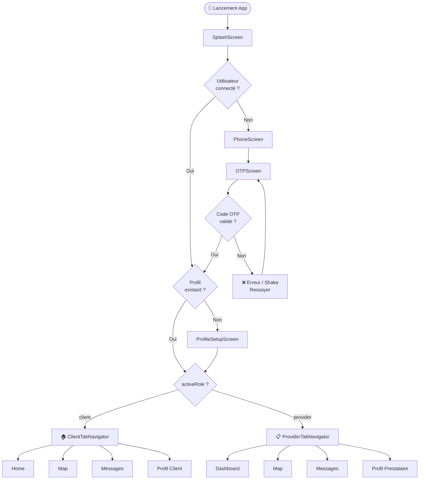

---

## 2. FLUX D'AUTHENTIFICATION OTP

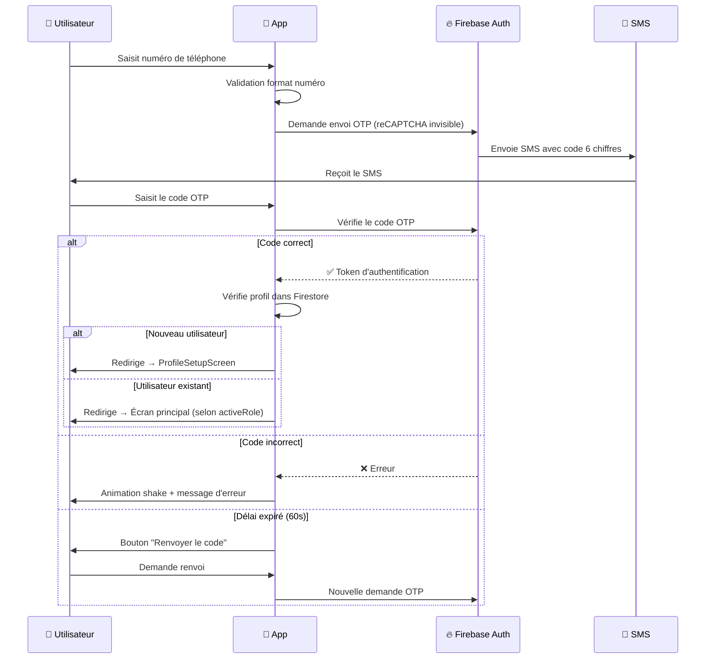

---

## 3. ONBOARDING CLIENT

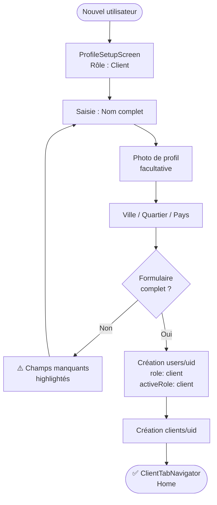

---

## 4. ONBOARDING PRESTATAIRE — MULTI-ÉTAPES

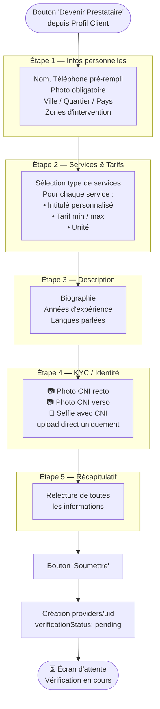

---

## 5. FLUX DE VÉRIFICATION DU COMPTE PRESTATAIRE

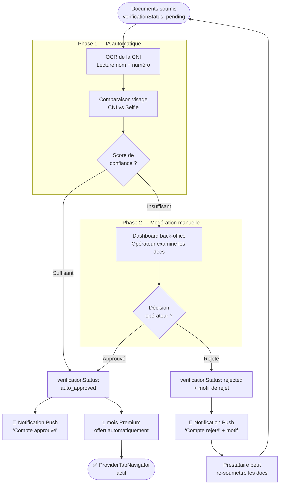

---

## 6. FLUX DE DEMANDE DE SERVICE

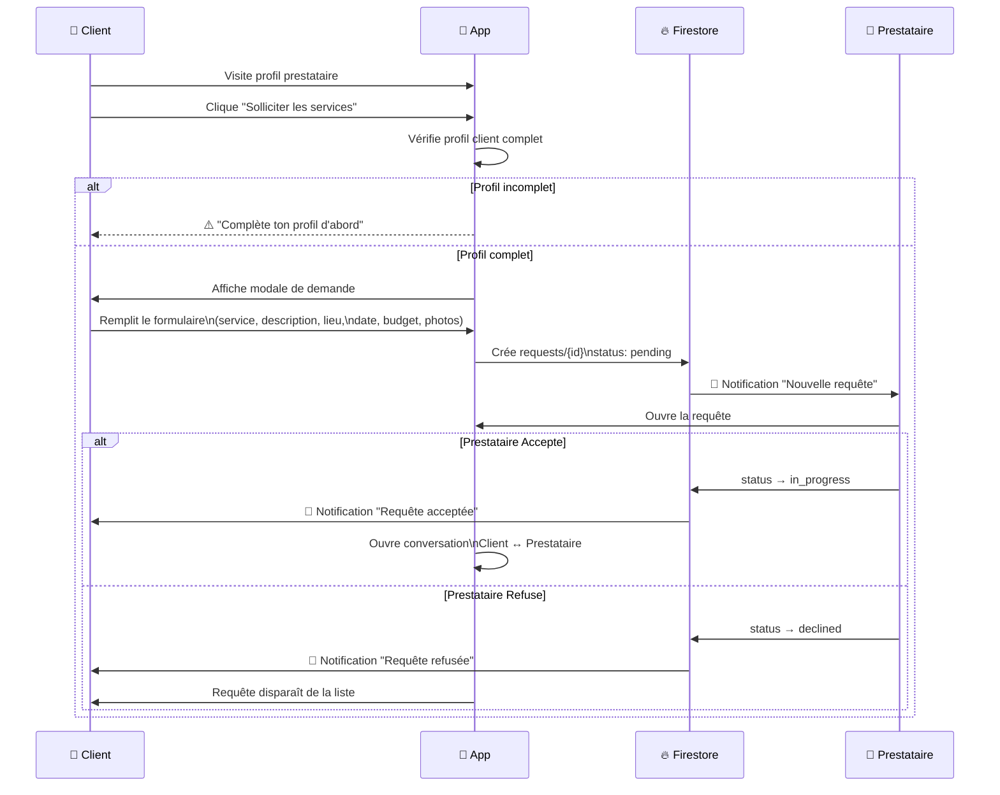

---

## 7. ÉTATS D'UNE REQUÊTE

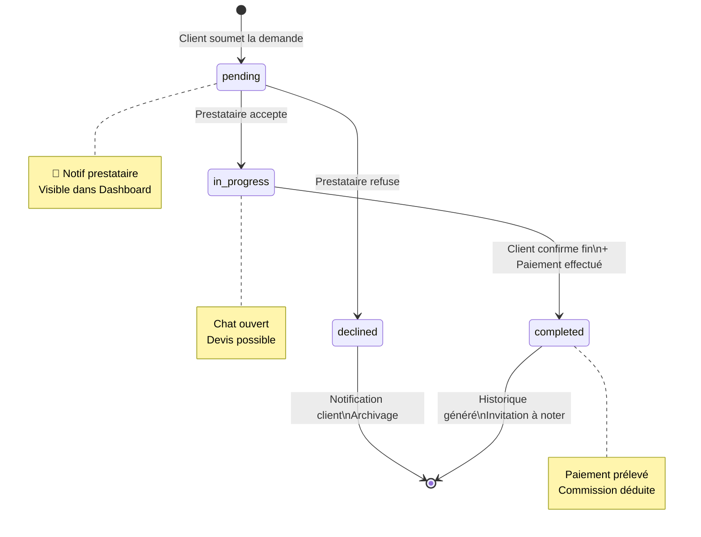

---

## 8. FLUX MESSAGERIE ET DEVIS

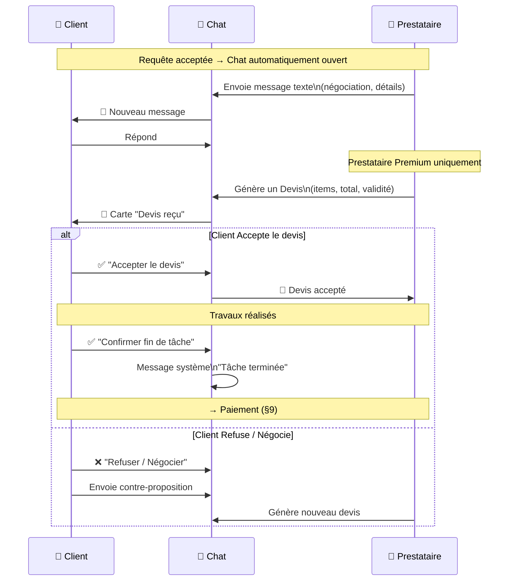

---

## 9. FLUX DE PAIEMENT

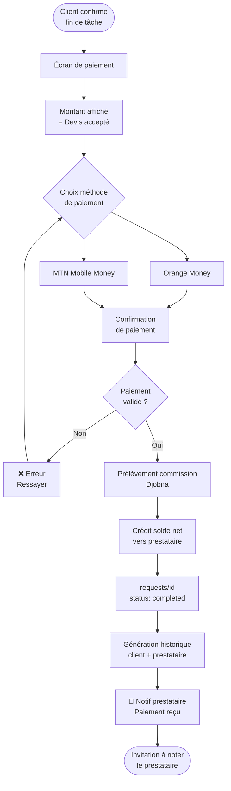

---

## 10. SYSTÈME D'ABONNEMENT

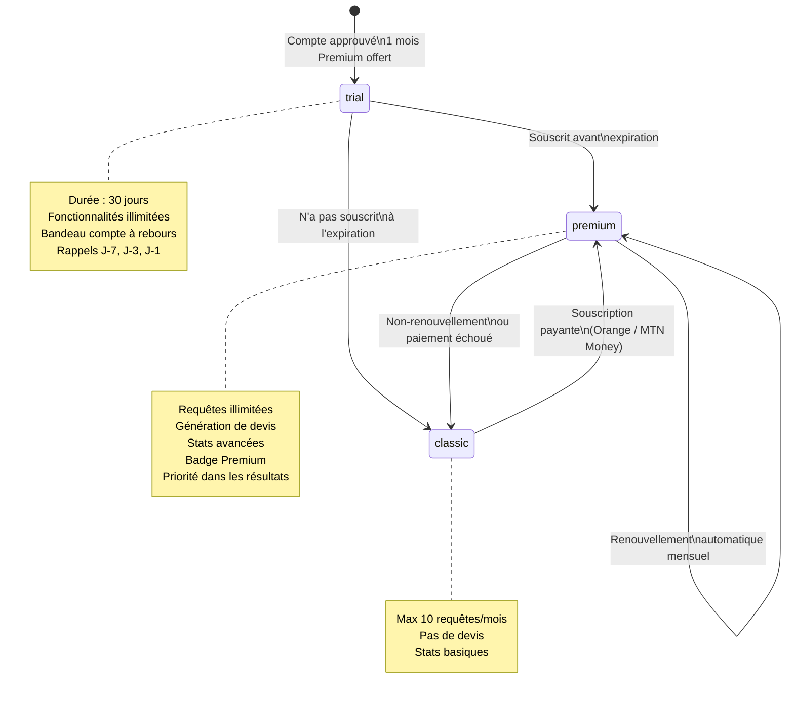

---

## 11. BASCULE DE RÔLE CLIENT ↔ PRESTATAIRE

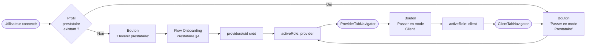

---

## 12. FLUX DE NOTATION ET AVIS

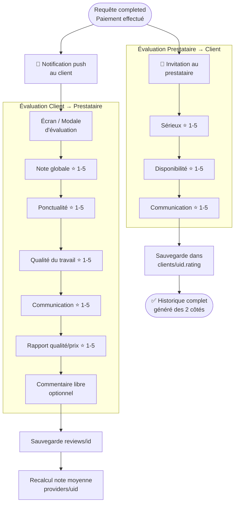

---

## 13. FLUX NOTIFICATIONS

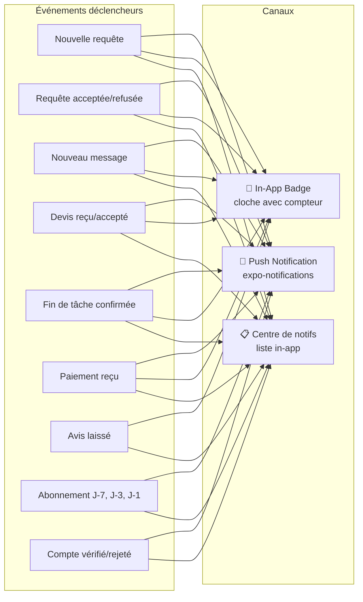

---

## 14. ARCHITECTURE GÉNÉRALE DES DONNÉES

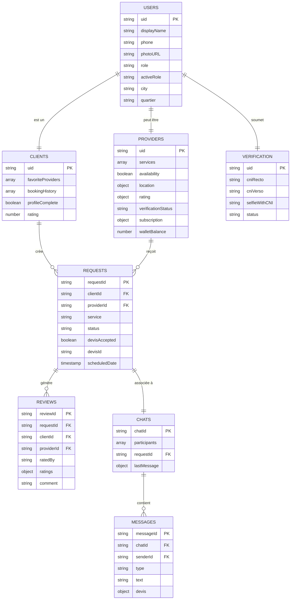

---

*Document généré à partir du flux_de_fonctionnement.md — v2.0*
